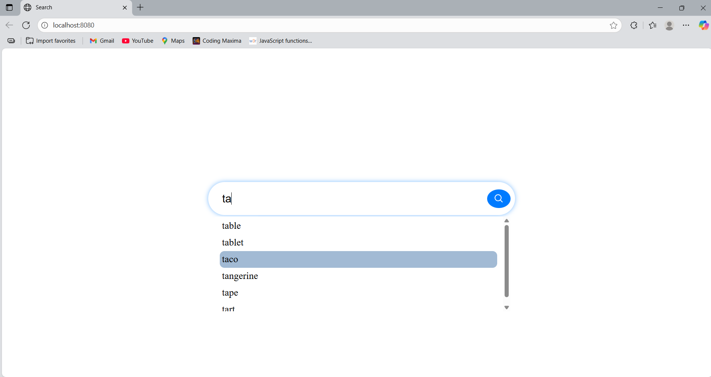
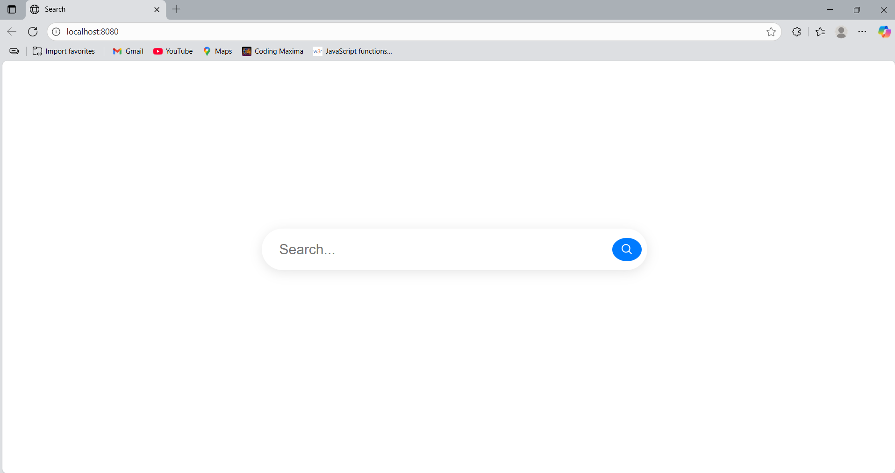

# 🔍 AutoComplete Search Engine

An intelligent autocomplete system that suggests search terms as you type — powered by a Trie (prefix tree) for optimized searching. This project demonstrates how to build a full stack search engine from scratch using JavaScript, Node.js, and custom data structures.

---

## 🚀 Features

- 🔤 Real-time search suggestions
- ⚡ Optimized search with Trie data structure
- 🔄 Frontend-backend interaction using JavaScript Fetch API
- 🧠 Easily extendable and customizable
- 💡 Clean and modular file structure

---

## 🛠️ Tech Stack

| Layer      | Technology            |
|------------|------------------------|
| Frontend   | HTML, CSS, JavaScript |
| Backend    | Node.js, Express.js    |
| Algorithm  | Trie Data Structure    |

---

## 📁 File Structure

AutoComplete-Search-Engine/
│
├── Ui.html # Frontend UI
├── index.css # Styling for the UI
├── index.js # Frontend logic and API calls
├── server.js # Backend logic using Node.js and Express
├── TrieDS.js # Trie data structure implementation
├── data.js # Sample search words list

pgsql
Copy
Edit

---

## 📌 How It Works

1. **User Input**  
   The user types into the search bar on `Ui.html`.

2. **Frontend Logic (`index.js`)**  
   Captures user input and sends it via `fetch()` to the backend (`server.js`).

3. **Backend Handling (`server.js`)**  
   Receives the query and uses `TrieDS.js` to find matching search terms from `data.js`.

4. **Trie Search (`TrieDS.js`)**  
   Efficiently finds all words starting with the typed prefix.

5. **Response**  
   Server returns matching suggestions, and frontend displays them in real time.

---

## ▶️ Getting Started

### 1. Clone the Repository
```bash
git clone https://github.com/your-username/AutoComplete-Search-Engine.git
cd AutoComplete-Search-Engine
2. Install Dependencies
bash
Copy
Edit
npm install
3. Start the Server
bash
Copy
Edit
node server.js
4. Open the Frontend
Open Ui.html in your browser directly or serve it via Live Server (VS Code extension).

🧪 Sample Data
data.js contains an array like:

javascript
Copy
Edit
module.exports = [
  "apple", "application", "apply", "banana",
  "band", "banner", "can", "candle", "cap"
];
📸 Screenshots
Here’s a preview of the AutoComplete feature:




🚧 Future Improvements
 Connect to a real-time database (e.g., MongoDB or Firebase)

 Add debounce for better performance

 Enhance UI/UX with better styling

 Implement fuzzy or typo-tolerant search

 Add unit tests for the Trie

🙌 Contributing
Feel free to fork and enhance this project. Contributions are welcome!

📄 License
This project is open source and available under the MIT License.

yaml
Copy
Edit

---

### ✅ Next Steps for You:
1. **Create this README.md file** in your project root folder.
2. **Customize the GitHub link**, your name, screenshots, and any extra features.
3. Use this when you **upload your project to GitHub** — it makes your project much more professional and understandable.

Let me know if you'd like a matching `LICENSE` file or GitHub `.gitignore` template.
   